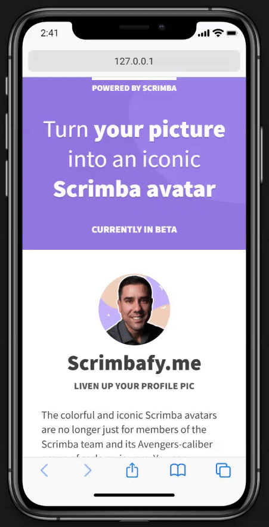
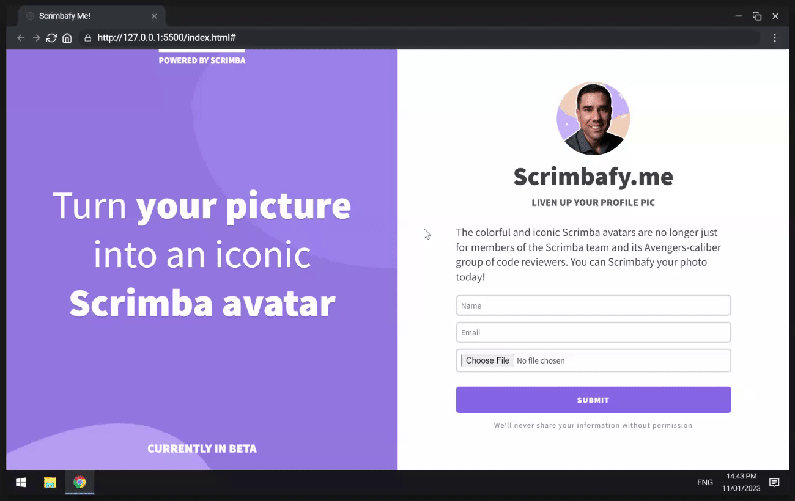

# Scrimba - The Frontend Developer Career Path - Module 6 Responsive Design - Build a Product Splash Page

## Table of contents
- [Scrimba - The Frontend Developer Career Path - Module 6 Responsive Design - Build a Product Splash Page](#scrimba---the-frontend-developer-career-path---module-6-responsive-design---build-a-product-splash-page)
  - [Table of contents](#table-of-contents)
  - [Quick start:](#quick-start)
  - [About Scrimba](#about-scrimba)
  - [Overview](#overview)
    - [What will be learned](#what-will-be-learned)
    - [Screenshot](#screenshot)
    - [Links](#links)
  - [Author](#author)

## Quick start:

```
$ npm install
$ npm start
```

Head over to https://vitejs.dev/ to learn more about using vite

## About Scrimba

At Scrimba our goal is to create the best possible coding school at the cost of a gym membership! 💜
If we succeed with this, it will give anyone who wants to become a software developer a realistic shot at succeeding, regardless of where they live and the size of their wallets 🎉
The Frontend Developer Career Path aims to teach you everything you need to become a Junior Developer, or you could take a deep-dive with one of our advanced courses 🚀

- [Our courses](https://scrimba.com/allcourses)
- [The Frontend Career Path](https://scrimba.com/learn/frontend)
- [Become a Scrimba Pro member](https://scrimba.com/pricing)

Happy Coding!

## Overview

### What will be learned


### Screenshot




### Links

- Solution URL: [Github Repo]()
- Live Site URL: [Netlify Live Site]()

## Author

- Website - [Evalia Varona](https://www.evaliavarona.com)
- Hashnode - [@evavarona](https://evaliavarona.hashnode.dev)